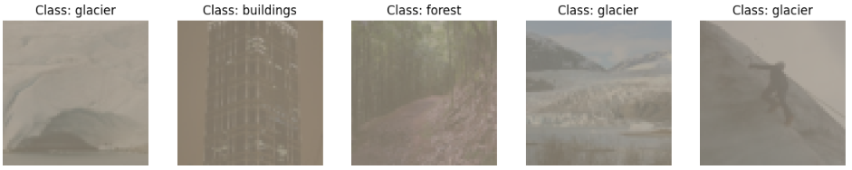

# Patch Viz: Visualizing the Impact of Adversarial Patches

Patch Viz is a Python package for generating, applying, and visualizing the impact of adversarial patches on Convolutional Neural Networks (CNNs). With this tool, you can create adversarial patches for specific target classes, apply them to input images, and analyze their effects using saliency maps and Grad-CAM visualizations.

## How It Works

Here’s an overview of how Patch Viz works:

### 1. Adversarial Patch Creation

- Patch Viz trains adversarial patches to fool a pretrained model into misclassifying inputs to a specific target class.

- You can customize the patch size, target class, and number of training epochs.

### 2. Patch Application

- Once trained, the patch can be applied to any input image.
- For example, a patch trained to classify all images as "dog" can be applied to an image of a "cat," causing the model to predict "dog."

### 3. Impact Visualization

- Visualize the effects of adversarial patches on input images using:
  - Saliency Maps: Highlight regions of the image influencing the model's predictions.
  - Grad-CAM: Visualize important areas contributing to the model's decisions.

## Features

- Train patches: Generate adversarial patches for target classes and visualize their effectiveness.
- Visualize impact: Explore the influence of patches using Grad-CAM and saliency maps.
- Built-in datasets: Use sample datasets (e.g., Intel Image Classification, Emotions) to test functionality out of the box.

## Installation

To install Patch Viz, run:

```bash
pip install patchviz
```

## Requirements

- Requires Python 3.10 or later.
- The package supports both CPU and GPU.

## Usage

To use the ```patchviz``` package, you will need access to the following:

- Dataset
- Model Weight File (.pth/.pt)
- Model Architecture Class
- Number of Classes
- The Pytorch ```transforms``` object used during training

Here’s how you can visualize the impact of adversarial patches using the sample Intel dataset:

```python
# Import required libraries

from patchviz import DatasetLoader, ModelLoader, AdversarialPatch, Visualizer, Explainer, get_sample_model
```

```python
# Step 1: Load in Dataset (Intel dataset)

model_inst, num_classes, transform = get_sample_model("intel")

data_dir = "path_to_intel_dataset"

loader = DatasetLoader(data_dir=data_dir,transform=transform)

# Get a sample batch
images, labels = loader.get_sample_batch()
print(f"Batch size: {len(images)}")

# Plot a sample batch
loader.plot_sample_batch()
```

Output

```python
Batch size: 16
tensor([2, 0, 1, 2, 2, 2, 2, 2, 4, 0, 4, 1, 0, 0, 0, 5])
```



```python
# Step 2: Load in CNN Model (Custom Weights/Pretrained Model)

device = torch.device("cuda" if torch.cuda.is_available() else "cpu")

custom_weights = "path_to_intel-class.pth"

model_loader = ModelLoader(
    model_inst=model_inst,
    num_classes=num_classes,
    custom_weights=custom_weights,
    device=device
)

model = model_loader.model
```

Output

```bash
Loaded custom weights from path_to_intel-class.pth

```

 ```python
 # Step 3: Create and Train Adversarial Patch

 adv_patch = AdversarialPatch(
    model=model,
    loader=loader,
    device=device
)

patch_dict = adv_patch.get_patches(
    class_names=["class_name"],
    patch_sizes=[16],
    num_epochs=10,
)
```

Output

```bash
Epoch 10, Loss: 0.26:  100%|█████████| 350/350 [00:03<00:22, 13.51it/s]

Validating...:  100%|█████████| 878/878 [00:07<00:56, 13.76it/s]

Validation results for class_name and (16, 16): {'acc': 0.5214285850524902, 'top5': 0.9979804158210754}

```

```python
# Step 4: Visualize the effect of the trained patches on predictions

viz = Visualizer(
    idx_to_class=loader.idx_to_class,
    adv_patch=adv_patch,
    model=model,
)


viz.show_predictions(
    images=images,
    labels=labels,
    patch=patch_dict["class_name"][16]['patch'],
)
```

Output


```python
# Step 5: Load in Explainer and visualize the effect of patches on Saliency and GRAD CAM maps

explainer = Explainer(
    model=model,
    adv_patch=adv_patch,
    device=device
)

explainer.explain(
    images=images,
    labels=labels,
    patch=patch_dict["sea"][16]['patch'],
)
```

Output


## Example Datasets and Models

Patch Viz is designed to work with two dataset-model pairs to help you get started out of the box.

### Datasets

These datasets can be downloaded and used directly with the package:

#### 1. Intel Image Classification Dataset

- Dataset: [Intel Image Classification Dataset](https://www.kaggle.com/datasets/puneet6060/intel-image-classification)
- Structure: Contains images classified into categories such as forest, glacier, mountain, sea, and street.
- Loading it in: load the sample in using ```get_sample_model("intel")```

#### 2. Emotions Dataset

- Dataset: [Emotions Dataset](https://www.kaggle.com/datasets/yousefmohamed20/sentiment-images-classifier)
- Structure: Contains images of faces labeled with emotional categories (e.g., happy, sad, angry).
- Loading it in: load the sample in using ```get_sample_model("emot")```

### Models

Similarly, the model weights for the corresponding dataests have been provided for downloading in the ```models``` foler:

- Intel Image Classification Dataset: intel-class.pth
- Emotions Dataset: emot-class-v2.pth

## How to Interpret the Visualizations

### Original/Patched Predictions

The following are the key visualizations provided by Patch Viz:

- Original Image:
  - Displays the unaltered input image.

- Original Predictions:
  - Shows the model's prediction on the original image as a graph of confidence for each class

- Patched Image:
  - Shows the same image after applying the adversarial patch.

- Patched Predictions:
  - Shows the model's prediction on the patched image as a graph of confidence for each class

#### Example Visualization Output

- Each row corresponds to a single input image. The columns show:

  - Original Image → Original Predictions
  - Patched Image → Patched Predictions

### GRAD-CAM & Saliency Maps

The following are the key visualizations provided by Patch Viz:

- Original Image:
  - Displays the unaltered input image.

- Patched Image:
  - Shows the same image after applying the adversarial patch.

- Grad-CAM:
  - Highlights areas of the image most important for the model’s predictions.

- Saliency Maps:
  - Displays pixel-level contributions to the model’s decision.

#### Example GRAD-CAM & Saliency Maps Output

- Each row corresponds to a single input image. The columns show:

  - Original Image → Saliency Map → Grad-CAM
  - Patched Image → Patched Saliency Map → Patched Grad-CAM

## Contributing

I welcome contributions! Please feel free to open an issue or submit a pull request if you have any improvements or ideas.

## License

This project is licensed under the MIT License. See the LICENSE file for details.

## Acknowledgments

Patch Viz builds on:

- PyTorch for deep learning.
- Captum for interpretability tools.
- Matplotlib for visualizations.
